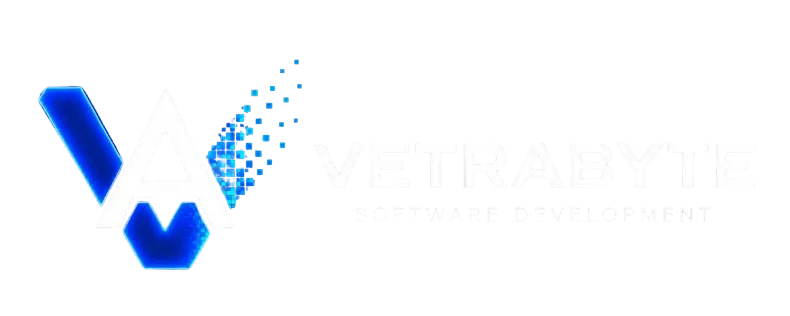

<p align="center">
  
</p>

<h1 align="center">Nicolás Butterfield</h1>

<p align="center">
  <strong>Full-stack developer building practical software at the intersection of web, Linux and sound.</strong>
</p>

<p align="center">
  Río Gallegos, Argentina · Open to freelance work and open-source collaboration
</p>

<p align="center">
  <a href="mailto:nicobutter@gmail.com"></a>
  <a href="https://www.linkedin.com/in/nicol%C3%A1s-butterfield-9964aa1a3"></a>
  <a href="https://soundcloud.com/user-785671138/perda"></a>
</p>

## About me

I turn ideas into maintainable web applications—from backend logic and data models to responsive interfaces. My main ecosystem includes **Python/Django**, **Java/Spring Boot** and **TypeScript/Angular**, supported by relational databases, Docker and Linux.

Away from product code, I experiment with audio tooling, desktop customization and local AI workflows. I am especially interested in projects where technology becomes a creative instrument.

```text
Currently building  → Full-stack web applications
Currently learning  → Cloud architecture, DevOps and microservices
Happy to discuss    → Freelance projects, open source and creative tech
```

## 🚀 Vetrabyte

<div align="center">
  
  <h3>Software built to operate, grow and evolve</h3>
  <p>
    Vetrabyte is my software development venture—the brand under which I build web applications,
    management systems, SaaS platforms, automations, APIs and digital infrastructure for businesses,
    professionals and organizations.
  </p>
  <p><code>Web Development</code> · <code>SaaS</code> · <code>Management Systems</code> · <code>Automation</code> · <code>APIs</code> · <code>Infrastructure</code></p>
  <a href="https://vetrabyte.com.ar/"></a>
</div>

## Selected work

| Project | What it explores | Stack |
| --- | --- | --- |
| **Dev Soundtrack** | Audio integrated into developer workflows | Creative tooling · Audio |
| **Iconwear KDE** | Icons and visual customization for the Linux desktop | KDE · Linux |
| **UNPA Coding Games** | Educational games for practicing algorithms | Programming education |
| **LibroLink** | A library management experience with a modern interface | Django · PostgreSQL · Bootstrap |
| **TEAM3 Backend** | A Java web backend built around servlets and relational data | Java · Tomcat · MySQL |

<p align="center">
  <a href="https://github.com/NicoButter?tab=repositories"><strong>Explore all repositories →</strong></a>
</p>

## Toolbox

<p align="center">
  
</p>

<details>
<summary><strong>How I like to work</strong></summary>

- Start with the problem, then choose the technology.
- Keep interfaces clear and systems easy to maintain.
- Automate repetitive work and document the decisions that matter.
- Learn in public through projects, experiments and open source.

</details>

## GitHub activity

<p align="center">
  
</p>

### Languages and repository stats

<p align="center">
  
  
</p>

### Recent GitHub activity

<p align="center">
  
</p>

### Contributions

<p align="center">
  
</p>

<sub>These dashboards are generated automatically by GitHub Actions from GitHub data and refreshed daily.</sub>

> GitHub language statistics describe repository content; they are not a measure of proficiency.

## Beyond code

I produce electronic music—sometimes atmospheric, sometimes experimental—and explore ways to connect software with sound. You can hear some of that work on [SoundCloud](https://soundcloud.com/user-785671138/perda).

If you have a web product to build, an open-source idea to share or an unusual creative-tech experiment, [send me an email](mailto:nicobutter@gmail.com).

<p align="center"><sub>Follow the white rabbit.</sub></p>
