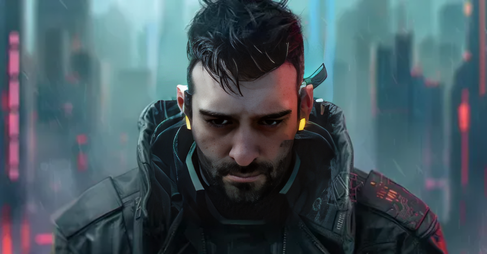

<!-- Header Banner con Gradiente -->


<p align="center">
  
</p>

<p align="center">
  
</p>

<!-- Social Badges Modernos -->
<p align="center">
  <a href="https://github.com/NicoButter">
    
  </a>
  <a href="https://www.linkedin.com/in/nicolás-butterfield-9964aa1a3">
    
  </a>
  <a href="mailto:nicobutter@gmail.com">
    
  </a>
  <a href="https://soundcloud.com/user-785671138/perda">
    
  </a>
</p>

<p align="center">
  
  
  
</p>

---

##  About Me


```yaml
name: Nicolás Butterfield
location: Río Gallegos, Argentina 🇦🇷
role: Freelance Fullstack Developer Jr.
passion: Mixing code with music production

currently:
  - 🔭 Building apps with Django, Angular & Spring Boot
  - 🌱 Learning: Microservices, Cloud (AWS/GCP), DevOps
  - 🎵 Producing electronic music in free time
  
open_to:
  - Open Source contributions
  - Web platforms & ML tools
  - Music tech experiments
  
fun_fact: "I debug code while listening to my own beats"
```

<br clear="right"/>

---

## 🛠️ Tech Arsenal

<table align="center">
<tr>
<td align="center" width="33%">

### 💻 Languages
<p>
  
</p>

</td>
<td align="center" width="33%">

### 🚀 Frameworks
<p>
  
</p>

</td>
<td align="center" width="33%">

### 🗄️ Databases & Tools
<p>
  
</p>

</td>
</tr>
</table>

<p align="center">
  
</p>

---

## 🌟 Featured Projects

<p align="center">
  <a href="https://github.com/NicoButter/dev-soundtrack">
    
  </a>
  <a href="https://github.com/NicoButter/iconwear-kde">
    
  </a>
</p>

<p align="center">
  <a href="https://github.com/NicoButter/UNPA_Coding_Games">
    
  </a>
</p>

<details>
<summary>📂 <b>More Projects</b></summary>
<br>

| 🚀 Project | 📝 Description | 🛠️ Tech Stack |
|:-----------|:---------------|:--------------|
| [📚 LibroLink](https://github.com/NicoButter/LibroLink) | Library management system with modern UI | \`Django\` \`PostgreSQL\` \`Bootstrap\` |
| [🧩 TEAM3 Backend](https://github.com/NicoButter/Proyecto_TEAM3_24112_Backend) | Java web application with Servlets | \`Java\` \`Tomcat\` \`MySQL\` |

</details>

---

## 📊 GitHub Analytics

<p align="center">
  
  
</p>

<p align="center">
  
</p>

<!-- Activity Graph -->
<p align="center">
  
</p>

<!-- Trophies -->
<p align="center">
  
</p>

---

## 🖥️ My Setup

<table align="center">
<tr>
<td>

| 🔧 Component | 📋 Details |
|:------------|:-----------|
| 💻 **Laptop** | HP Victus 16 |
| 🐧 **OS** | openSUSE Tumbleweed |
| 🛠️ **IDEs** | VS Code, Eclipse, Kate |
| 📟 **Terminal** | Yakuake + Zsh |
| 🎵 **Music** | Clementine |
| 🎹 **DAW** | Cubase SX 5 |
| 🤖 **AI/LLM** | Local LLMs on Linux |

</td>
<td>


</td>
</tr>
</table>

---

## 🎵 Beyond The Code

<p align="center">
  <a href="https://soundcloud.com/user-785671138/perda">
    
  </a>
</p>

> 🎹 *I produce electronic music in my spare time — sometimes chill, sometimes experimental.*  
> 💡 *Currently exploring the intersection of code and music — building tools for creative expression.*

---

##  Let's Connect & Collaborate!

<p align="center">
  <a href="mailto:nicobutter@gmail.com">
    
  </a>
</p>

<p align="center">
  
</p>

---

<p align="center">
  <b>�� "Sin programador no hay software. Con los demás, solo hay reuniones."</b>
</p>

<!-- Footer -->

